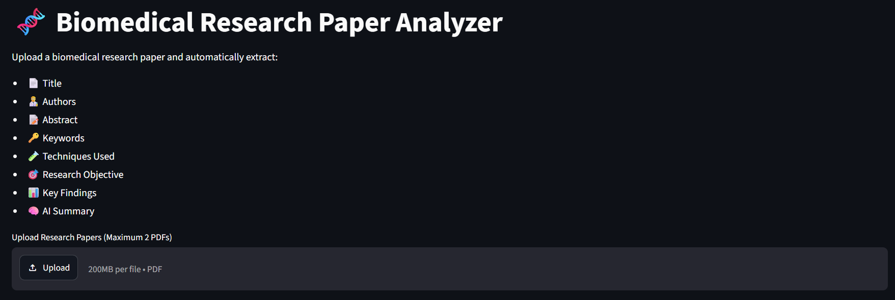
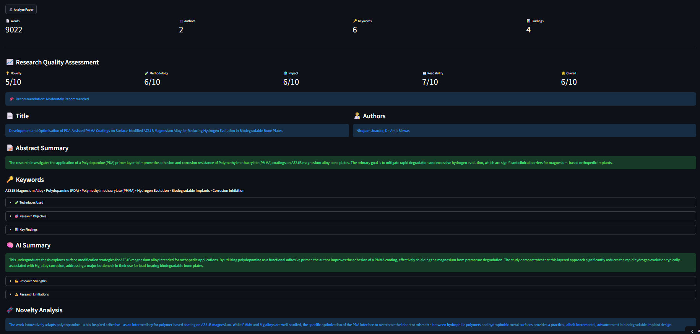
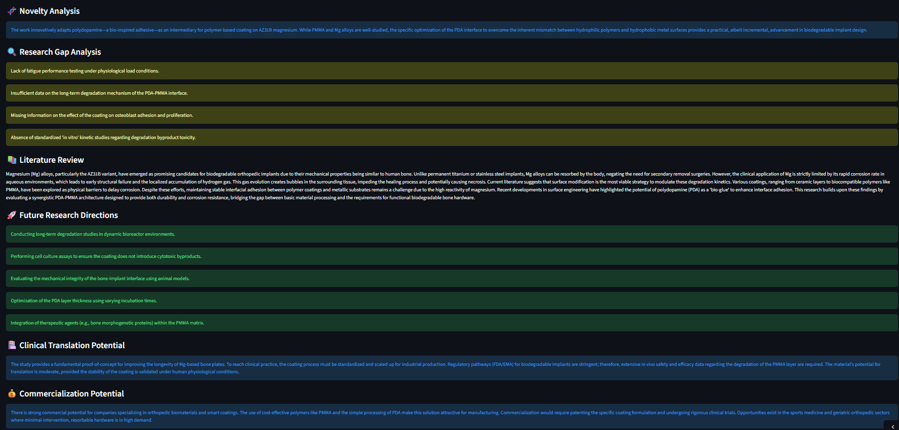

# 🧬 Biomedical Research Paper Analyzer

An AI-powered web application that automatically analyzes biomedical research papers and generates structured insights using **Google Gemini AI** and **Streamlit**.

For the best mobile experience, use Firefox if file uploads do not work properly in Chrome on some Android devices.   

## 🚀 Live Demo

https://biomedical-research-paper-analyzer.streamlit.app/

## 📌 Features

### 📄 Paper Analysis

* Extracts text from uploaded PDF research papers
* Identifies title, authors, keywords, and research objectives
* Generates concise AI-powered summaries

### 📊 Research Quality Assessment

* Novelty Score
* Methodology Score
* Impact Score
* Readability Score
* Reproducibility Score
* Overall Research Quality Score

### 🔬 Research Insights

* Literature Review Generation
* Research Gap Analysis
* Future Research Directions
* Clinical Translation Potential
* Commercialization Potential
* Potential PhD Research Ideas

### 📚 Paper Comparison Mode

* Compare two research papers side-by-side
* Visual score comparison
* AI-generated comparison summary

### 💬 Research Assistant Chat

* Ask questions about the uploaded paper
* Context-aware paper exploration

### 📄 PDF Report Generation

* Download a structured analysis report
* Includes scores, findings, strengths, limitations, and recommendations

---

## 🛠 Tech Stack

### Frontend

* Streamlit

### AI & NLP

* Google Gemini AI

### Data Processing

* PyMuPDF (PDF Text Extraction)
* Pandas
* NumPy

### Visualization

* Matplotlib
* Plotly

### Reporting

* ReportLab

---

## 📸 Screenshots

### Home Page





---

## 📂 Project Structure

```text
Biomedical-Research-Paper-Analyzer/
│
├── app.py
├── requirements.txt
├── .gitignore
├── screenshots/
├── assets/
└── README.md
```

---

## ⚙ Installation

```bash
git clone https://github.com/biotech-py/Biomedical-Research-Paper-Analyzer.git

cd Biomedical-Research-Paper-Analyzer

pip install -r requirements.txt

streamlit run app.py
```

---

## 👨‍💻 Author

Nirupam Joarder

B.Tech Biotechnology, NIT Rourkela

Interested in:

* Biomedical AI
* Bioinformatics
* Data Analytics
* Translational Research
